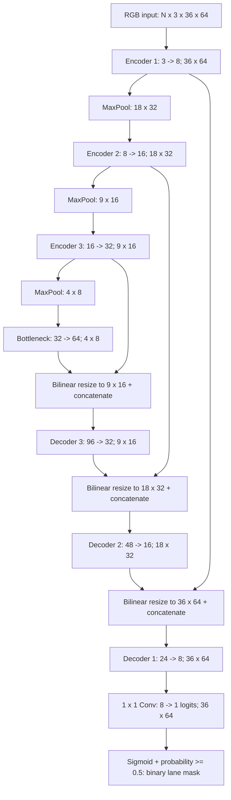
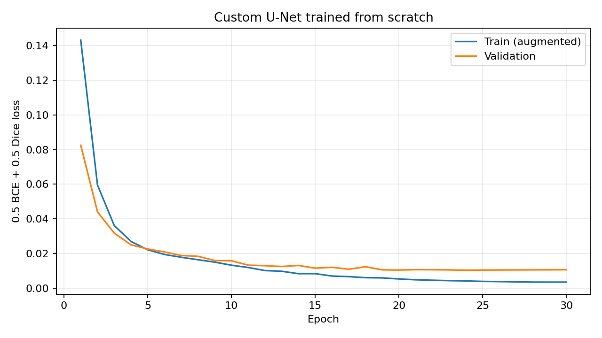
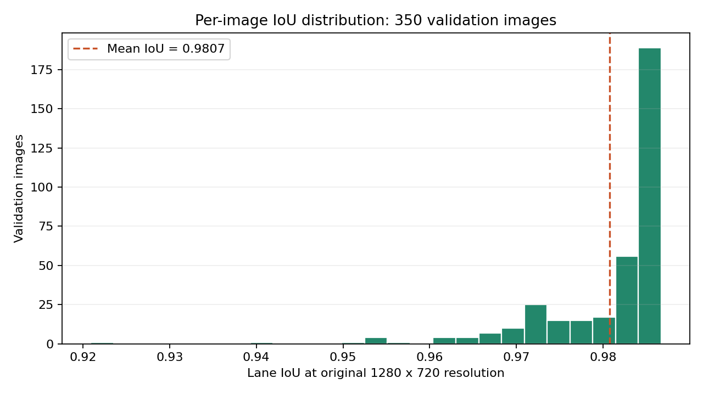
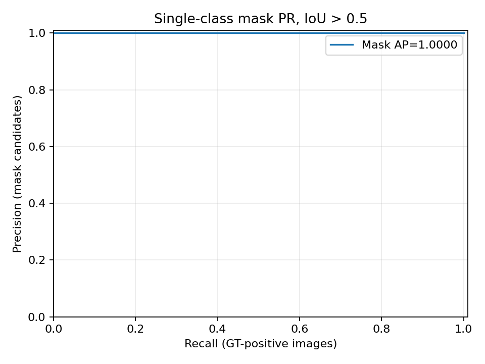
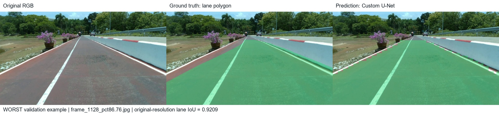
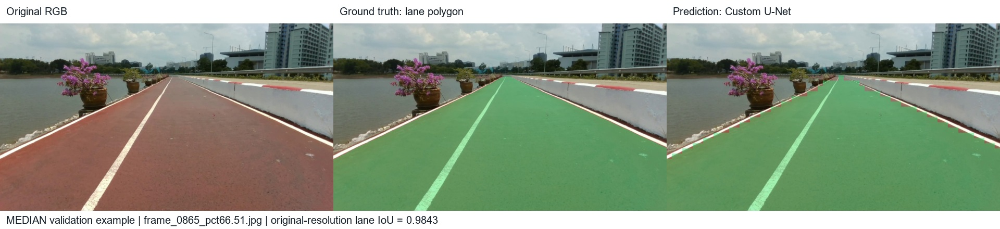
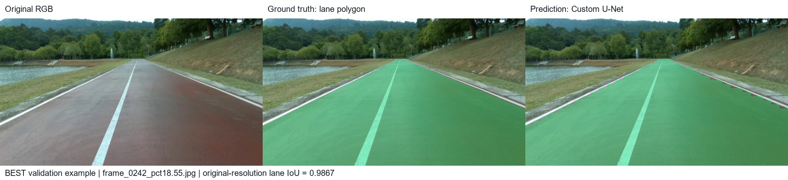

# Assignment-10: PSU Reservoir Lane Segmentation

สร้าง Custom U-Net เพื่อแยก **พื้นที่เลน / พื้นหลัง** โดยออกแบบโครงสร้างเองและเทรนทุก layer จากศูนย์ ไม่มี pretrained weights ใช้เฉพาะ polygon ของ `lane` (class 3) จาก PSU-reservoir dataset ผลทั้งหมดด้านล่างมาจากการรันจริงบนเครื่อง local

## ภาพรวมและวัตถุประสงค์ของโครงงาน

โครงงานนี้รับภาพถนนจากกล้องมุมมองด้านหน้า แล้วทำนายว่าพิกเซลใดอยู่ในพื้นที่เลนตาม polygon ของ dataset เป้าหมายคือสร้าง pipeline ที่ทำงานได้ครบตั้งแต่ annotation → ground-truth mask → training → inference → evaluation และควบคุมขนาดโมเดลให้ใช้งานบน laptop/PC ได้

คำว่า **lane** ในโครงงานนี้หมายถึง **พื้นที่ผิวถนน/ช่องทางตาม class `lane` ที่ผู้ทำ dataset กำหนด** ไม่ใช่การทำนายเฉพาะสีของเส้นขาวบนถนน โมเดลรวม polygon ของคลาสนี้เป็น foreground หนึ่งคลาสและใช้พื้นที่ที่เหลือเป็น background ไม่แยก instance หรือเลนซ้าย/ขวาเป็นคนละ output channel

| รายการสำคัญ | ค่าของ experiment ที่รายงาน |
|---|---|
| งาน | Binary semantic lane segmentation |
| สถาปัตยกรรม | Custom U-Net, encoder 3 ระดับ + bottleneck + decoder 3 ระดับ |
| การเริ่มต้น | Random initialization; trainable ทุก layer |
| ข้อมูล | PSU-reservoir 1,000 ภาพ; ใช้เฉพาะ polygon |
| Split | Train 650 / validation 350 (65:35), seed 42 |
| Input / output โมเดล | RGB 36×64 / logits 1×36×64 |
| Train | 30 epochs, batch 4, BCE + Dice |
| Checkpoint ที่ประเมิน | best.pt, epoch 26 |
| Mean lane IoU ที่ขนาดต้นฉบับ | 0.980733 |
| อุปกรณ์ | NVIDIA GeForce GTX 1650 |

## สารบัญ

1. [โครงสร้าง Neural Network และเหตุผล](#โครงสร้าง-neural-network-และเหตุผล)
2. [Dataset และการเตรียม mask](#dataset-และการเตรียม-mask)
3. [การติดตั้งและคำสั่งรัน](#การติดตั้งและคำสั่งรัน)
4. [การเทรนจริงและกราฟ loss](#การเทรนจริงและกราฟ-loss)
5. [ประสิทธิภาพที่วัดจริง](#ประสิทธิภาพที่วัดจริง)
6. [Snapshot ก่อน/หลัง inference](#snapshot-ก่อนหลัง-inference)
7. [Inference memory footprint](#inference-memory-footprint)
8. [ข้อจำกัดและแนวทางพัฒนา](#ข้อจำกัดและแนวทางพัฒนา)
9. [โครงสร้างและการส่งงาน](#โครงสร้างและการส่งงาน)
10. [งานที่เกี่ยวข้องและเอกสารอ้างอิง](#งานที่เกี่ยวข้องและเอกสารอ้างอิง)

## โครงสร้าง Neural Network และเหตุผล

U-Net มี encoder 3 ระดับ (8, 16, 32 channels), bottleneck 64 channels และ decoder ที่เชื่อม skip connections จำนวน **122,465 parameters** แต่ละ block ใช้ Conv 3×3 → GroupNorm → ReLU สองครั้ง แล้วใช้ Conv 1×1 เป็น output 1 channel

เลือกจำนวน channels น้อยเพื่อลด memory; GroupNorm เหมาะกับ batch เล็ก; skip connections ช่วยรักษาตำแหน่งพื้นที่เลน; bilinear upsampling ให้ขนาดตรงกับ skip tensor จึงรองรับ 36×64 ที่หารด้วย 8 ไม่ลงตัว ดู [แผนภาพ Mermaid และขนาด tensor](custom-unet-architecture.md) และ [model.py](model.py)

Input โมเดล: **H=36, W=64, RGB 3 channels**; output: logits 36×64 และ binary mask หลัง sigmoid ภาพต้นฉบับ 1280×720 ถูก resize เข้าโมเดล และ mask ถูกขยายกลับด้วย nearest-neighbor การขยายกลับไม่ได้สร้างรายละเอียดที่สูญเสียไปขึ้นใหม่

### แผนภาพเครือข่าย

ใน PyTorch ใช้ลำดับมิติ `N×C×H×W` โดย `N` คือ batch size ขณะที่ขนาด input ในโจทย์เขียนเป็น `H×W×C` จึงเป็นภาพขนาดสูง 36 พิกเซล กว้าง 64 พิกเซล และมีสี 3 channels



### ขนาด tensor และ parameters รายส่วน

ตารางนี้ใช้ `base_channels=8` ตาม checkpoint ที่ส่งงาน จำนวน parameters รวมทั้ง convolution weights, GroupNorm scale/bias และ bias ของ output head; pooling, interpolation, ReLU และ concatenation ไม่มี trainable parameters

| ส่วน | Input tensor (ไม่รวม N) | Output tensor (ไม่รวม N) | Trainable parameters |
|---|---|---|---:|
| Encoder 1 (`e1`) | 3×36×64 | 8×36×64 | 824 |
| MaxPool 1 | 8×36×64 | 8×18×32 | 0 |
| Encoder 2 (`e2`) | 8×18×32 | 16×18×32 | 3,520 |
| MaxPool 2 | 16×18×32 | 16×9×16 | 0 |
| Encoder 3 (`e3`) | 16×9×16 | 32×9×16 | 13,952 |
| MaxPool 3 | 32×9×16 | 32×4×8 | 0 |
| Bottleneck | 32×4×8 | 64×4×8 | 55,552 |
| Resize + concat skip 3 | 64×4×8 + 32×9×16 | 96×9×16 | 0 |
| Decoder 3 (`d3`) | 96×9×16 | 32×9×16 | 36,992 |
| Resize + concat skip 2 | 32×9×16 + 16×18×32 | 48×18×32 | 0 |
| Decoder 2 (`d2`) | 48×18×32 | 16×18×32 | 9,280 |
| Resize + concat skip 1 | 16×18×32 + 8×36×64 | 24×36×64 | 0 |
| Decoder 1 (`d1`) | 24×36×64 | 8×36×64 | 2,336 |
| Head Conv 1×1 | 8×36×64 | 1×36×64 | 9 |
| **รวม** | | | **122,465** |

### เหตุผลขององค์ประกอบแต่ละส่วน

**Double convolution 3×3:** แต่ละ block มี Conv → GroupNorm → ReLU สองชุด ใช้ padding=1 เพื่อรักษาขนาดภาพใน block การซ้อน convolution ช่วยสกัดลักษณะสี พื้นผิว และบริบทของถนนผ่านหลายขั้นตอนโดยไม่ใช้ kernel ขนาดใหญ่ทุกชั้น

**Encoder และ MaxPool:** ลดขนาดพื้นที่จาก 36×64 → 18×32 → 9×16 → 4×8 แล้วเพิ่ม channels จาก 8 → 16 → 32 → 64 เพื่อให้ส่วนลึกมองบริบทของพื้นที่เลนได้กว้างขึ้น เลือกเพียงสามระดับเพราะ input มีความละเอียดต่ำ หากลดหลายครั้งกว่านี้รายละเอียดส่วนปลายถนนจะเหลือน้อยมาก

**GroupNorm 4 groups:** normalize feature ภายในแต่ละตัวอย่างโดยไม่ใช้ running statistics ของ batch แบบ BatchNorm เหมาะกับการตั้ง batch size 2–4 ตามโจทย์ แต่ไม่ได้หมายความว่า GroupNorm จะดีกว่า BatchNorm ทุก dataset; งานนี้ไม่ได้ทำ ablation เปรียบเทียบ normalization

**Skip connections:** ส่ง feature ที่ยังมีความละเอียดสูงจาก encoder ไปต่อกับ feature ของ decoder เพื่อให้ decoder ใช้ทั้งรายละเอียดตำแหน่งและบริบทจาก bottleneck การเชื่อมเป็น concatenation ของ channels ไม่ใช่ residual addition

**Bilinear resize ให้ตรงกับ skip:** ใช้ `F.interpolate(size=skip.shape[-2:])` แทนการสมมติว่าขยายสองเท่าแล้วจะตรงเสมอ เนื่องจาก 9×16 ถูก MaxPool เหลือ 4×8 การขยาย 4 เป็น 8 จะไม่ตรงกับ skip ที่สูง 9 การระบุขนาดเป้าหมายโดยตรงแก้ dimension mismatch นี้

**Head 1×1 และ logits หนึ่ง channel:** แปลง feature 8 channels เป็นคะแนน foreground แต่ละพิกเซล ใช้ logits โดยตรงกับ BCEWithLogits ในการเทรน และใช้ sigmoid เฉพาะตอนคำนวณ Dice/ทำนาย จึงไม่ใส่ sigmoid เป็น layer ท้ายโมเดล

**จำนวน channels และ memory:** โมเดลมี 122,465 parameters หรือประมาณ 0.122 ล้านตัว น้ำหนักแบบ float32 เพียงอย่างเดียวคิดเป็น 0.467 MiB แต่การใช้งานจริงยังมี activation, tensor ชั่วคราว, runtime และ preprocessing จึงต้องวัด memory footprint แยกต่างหาก

**Train from scratch:** ทุก Conv ถูก Kaiming-normal initialized และ bias ที่มีถูกตั้งเป็นศูนย์ GroupNorm เริ่มจาก scale/bias ตามค่ามาตรฐานของ layer แล้วเรียนรู้ร่วมกับ convolution ไม่มีการโหลด backbone หรือ weights จากภายนอก การตรวจเทียบ checkpoint กับ model ที่สร้างด้วย seed เดียวกันพบว่า learned parameter tensors ทั้ง 44 ชุดเปลี่ยนไปหลังเทรน ดู [verification.json](results/verification.json)

## Dataset และการเตรียม mask

- แหล่งข้อมูล: PSU Reservoir Road Lane & Track Dataset, source video `psu-reservoir-2026Aug06_121427.mp4`; [DATACARD ต้นฉบับ](data/DATACARD.md)
- **65:35 = 650 train / 350 validation** สุ่มจากภาพทั้ง 1,000 ภาพด้วย NumPy default_rng seed 42 และบันทึกรายชื่อถาวรใน `splits/65-35/` ไม่มีภาพชื่อซ้ำระหว่างชุด และไม่แก้ manifests 800:200 ต้นฉบับ
- ภาพ 1,000 ภาพ ขนาด 1280×720; annotation มี class 0–4 แต่เลือก **class 3 `lane` เท่านั้น** รวม polygon เลนทุกชิ้นของภาพเป็น foreground mask; class อื่นและพื้นที่นอก polygon เป็น background
- Rasterize ที่ขนาดต้นฉบับ: พิกัด normalized คูณ width/height, ปัดเป็น pixel และ clip ที่ขอบ; resize mask ด้วย nearest-neighbor โดยรักษาค่า 0/255
- ตรวจ pairing, class IDs, finite coordinates, ช่วง [0,1], จำนวนจุดและพื้นที่ polygon; ไฟล์ annotation ที่หายหรือผิดรูปแบบจะไม่ถูกตีความเป็นภาพ background อย่างเงียบ ๆ
- ไม่พบภาพที่ไม่มี polygon เลน; พบ geometry ไม่ valid 291 polygon ในทุกคลาส รวม class lane 29 รายการ ใช้ vertices เดิมและ Pillow fill โดยไม่ได้ซ่อม annotation เอง ดูรายการใน [dataset_audit.json](results/dataset_audit.json)
- **ข้อจำกัดสำคัญ:** 314 จาก 350 validation images อยู่ห่าง train เพียง 1 เฟรม (median gap 1) จากวิดีโอเดียวกัน ผลจึงเป็น validation ภายในวิดีโอนี้ ไม่ใช่ independent test หรือหลักฐานว่ารองรับสถานที่/สภาพอากาศใหม่

### รูปแบบ annotation และการเลือกคลาส

หนึ่งบรรทัดในไฟล์ YOLO-seg มีรูปแบบดังนี้ โดยแต่ละบรรทัดเป็นหนึ่ง polygon และพิกัด normalized อยู่ในช่วง 0–1:

```text
class_id x1 y1 x2 y2 x3 y3 ... xn yn
```

| Class ID ใน dataset | ชื่อ | ใช้สร้าง foreground ของงานนี้หรือไม่ |
|---:|---|---|
| 0 | line_left | ไม่ใช้ |
| 1 | line_center | ไม่ใช้ |
| 2 | line_right | ไม่ใช้ |
| **3** | **lane** | **ใช้เฉพาะคลาสนี้** |
| 4 | non-track area | ไม่ใช้ |

ผล mask จึงไม่ได้รวม polygon ของเส้นซ้าย/กลาง/ขวาหรือพื้นที่ non-track เข้ากับ foreground และไม่อ่าน annotation แบบ bounding box หรือ polyline ใน pipeline นี้

### ขั้นตอนเปลี่ยน polygon เป็น ground truth

1. เปิดภาพและอ่านขนาดต้นฉบับ `W,H` ก่อน resize
2. ตรวจรูปแบบ annotation และเลือกเฉพาะ `class_id=3`
3. เปลี่ยนแต่ละจุดเป็น `x_pixel=round(x_normalized×W)` และ `y_pixel=round(y_normalized×H)` แล้วจำกัดพิกัดให้อยู่ในภาพ
4. วาด polygon ลงบนภาพ grayscale ที่เริ่มเป็นศูนย์ โดย fill พื้นที่เลนเป็น 255; polygon เลนหลายชิ้นถูก union ผ่านการ fill ลง mask เดียว
5. สำหรับ training ย่อ RGB ด้วย bilinear และ mask ด้วย nearest-neighbor ให้ได้ 64×36 จากนั้นแปลง RGB เป็น float32 ช่วง [0,1] และ mask เป็น float32 0/1
6. เก็บเฉพาะตัวอย่างที่ย่อแล้วในหน่วยความจำเพื่อไม่ต้อง decode ภาพต้นฉบับและ rasterize polygon ซ้ำทุก epoch; ไม่ cache ภาพเต็มทั้ง 1,000 ภาพ
7. สำหรับ evaluation สร้าง GT ที่ขนาดต้นฉบับ แล้วเปรียบเทียบกับ predicted mask ที่คืนขนาดกลับมาแล้ว

ไฟล์ annotation ที่ว่างรองรับได้โดยให้ mask เป็น background ทั้งภาพ แต่ไฟล์ที่หายหรือข้อมูลไม่ถูกต้องจะเกิด error ไม่ถูกมองเป็น empty ground truth โดยอัตโนมัติ Dataset ที่ใช้ใน experiment นี้ไม่มี empty lane image

### การแบ่งข้อมูลและหลักฐานการตรวจสอบ

รวมรายชื่อภาพจาก manifests ต้นฉบับ เรียงชื่อให้คงที่ แล้วสุ่ม permutation ด้วย `np.random.default_rng(42)` แบ่ง 650 รายการแรกเป็น train และ 350 รายการที่เหลือเป็น validation บันทึกไว้ที่ [train.txt](splits/65-35/train.txt) และ [val.txt](splits/65-35/val.txt) เพื่อใช้ชุดเดิมตลอดการเทรนและประเมิน

การตรวจสอบยืนยันว่าทั้งสองชุดไม่ทับซ้อนและรวมกันครบ 1,000 ภาพ ใช้ SHA-256 ของ manifests ตรวจว่า inference/evaluation ใช้ชุดเดียวกับที่บันทึกใน checkpoint ดู [split.json](splits/65-35/split.json) และ [config.json](results/training/config.json)

แม้รายชื่อภาพไม่ซ้ำกัน แต่ภาพที่ติดกันในวิดีโอมีฉากใกล้เคียงกัน จึงเรียกชุดนี้ว่า **validation** อย่างสม่ำเสมอ ไม่ใช้คำว่า independent test และไม่ได้แยก test ชุดที่สามใน experiment นี้

## การติดตั้งและคำสั่งรัน

ทดสอบบน Windows, Python 3.11.8, PyTorch 2.6.0+cu124, torchvision 0.21.0, NVIDIA GeForce GTX 1650, RAM 15.84 GiB / VRAM 4 GiB คำสั่งต่อไปนี้รันจาก root ของ repository

```powershell
python -m venv .venv
.venv\Scripts\Activate.ps1
# GTX 1650 / NVIDIA CUDA build used for this experiment
python -m pip install torch==2.6.0 torchvision==0.21.0 --index-url https://download.pytorch.org/whl/cu124
python -m pip install -r requirements-lock.txt
```

`requirements-lock.txt` ระบุเวอร์ชัน direct dependencies ที่รันจริง; `requirements.txt` ให้ช่วงเวอร์ชันที่รองรับ CPU installation: replace the PyTorch index URL with `https://download.pytorch.org/whl/cpu` and pass `--device cpu` to scripts. [Official installation reference](https://pytorch.org/get-started/locally/).

ZIP ที่ส่งพร้อมงานรวม dataset แล้ว หาก clone Git repository ให้คัดลอก `dataset_seg` จาก Assignment-8 มาไว้ที่ `data/dataset_seg/` โดยต้องมี `data_seg.yaml`, `train.txt`, `val.txt`, `images/all_images/` และ `labels/all_images/` ไม่ต้องแปลงเป็น bounding box หรือ polyline; ไฟล์ใหญ่และผล mask ถูก gitignore แต่มีใน ZIP

```powershell
python prepare.py --split-65-35
python -m unittest discover -s tests -v
python train.py --epochs 30 --batch-size 4 --height 36 --width 64 --output results/retrain
tensorboard --logdir results/retrain/tensorboard
python inference.py --checkpoint results/retrain/best.pt --output run/retrain
python evaluation.py --predictions run/retrain --output results/evaluation-retrain
python measure_memory.py --checkpoint results/retrain/best.pt --output results/memory-retrain.json
```

คำสั่งด้านบนใช้ output ใหม่เพื่อเก็บผลที่ส่งงานไว้; train/inference ป้องกันการเขียนทับ run เดิม ดู `--help` ของแต่ละ script สำหรับตัวเลือก input size, device, probability threshold และ IoU threshold

หากต้องการดู TensorBoard ของ **ผลที่ส่งงานและเทรนเสร็จแล้ว** โดยไม่เทรนซ้ำ:

```powershell
tensorboard --logdir results/training/tensorboard
```

การตรวจสอบของรอบที่ส่งงานมีผลบันทึกไว้แล้ว หากต้องการตรวจ checkpoint, split, mask dimensions, gradients และ inference บน CPU อีกครั้ง ใช้ `python verify_submission.py` ไม่ต้องใช้ตัวเลือก `--source` หากไม่มีสำเนา dataset อีกชุดให้เปรียบเทียบ

Inference ภาพเดี่ยวไม่ต้องมี annotation:

```powershell
python inference.py --input data/dataset_seg/images/all_images/frame_0006_pct00.38.jpg --output run/single-image
```

ทุก script ใช้ split **65:35 เป็นค่าเริ่มต้น** และผลทั้งหมดใน README มาจากการเทรนจาก random initialization ไม่ได้ฝึกต่อจาก checkpoint ของ experiment อื่น ข้อมูลที่ใช้งานอยู่ใน `data/dataset_seg/` และผลหลักเป็นรอบ 65:35 การสุ่ม split จากวิดีโอเดียวกันไม่ได้แก้ความเสี่ยง temporal leakage โดยอัตโนมัติ

## การเทรนจริงและกราฟ loss

เทรน **30 epochs**, batch 4, float32, seed 42; optimizer Adam เริ่ม LR 0.001; CosineAnnealingLR ลดถึง 1e-5; loss = **0.5 BCEWithLogits + 0.5 soft Dice loss** (smooth=1 เพื่อรองรับ empty mask) ไม่มี early stopping ก่อน 30 epochs

Augmentation เฉพาะ train: white balance ต่อ channel 0.95–1.05 (โอกาส 50%), brightness 0.90–1.10 (50%), Gaussian blur 3×3, sigma 0.2–0.7 (20%) ไม่ใช้ spatial augmentation ใน experiment นี้ จึงไม่มีการเปลี่ยนตำแหน่ง mask; validation ไม่ทำ random augmentation

### สูตร loss และเหตุผลที่รวมสองส่วน

กำหนด `z_i` เป็น logit ของ pixel ที่ i, `p_i=sigmoid(z_i)` และ `y_i` เป็น GT 0/1 สูตรเชิงแนวคิดคือ:

```text
L_BCE = -mean_i [y_i × log(p_i) + (1-y_i) × log(1-p_i)]

Dice_b = (2 × sum_i(p_bi × y_bi) + 1)
         / (sum_i(p_bi) + sum_i(y_bi) + 1)

L_Dice = 1 - mean_b(Dice_b)
L_total = 0.5 × L_BCE + 0.5 × L_Dice
```

`b` คือแต่ละภาพใน batch ส่วน `i` ครอบคลุมพิกเซลของภาพหนึ่งภาพ ในโค้ดคำนวณ BCE ด้วย `binary_cross_entropy_with_logits(z,y)` ไม่คำนวณ logarithm ของ probability โดยตรง ส่วน Dice ใช้ probability แบบต่อเนื่อง (soft Dice) เพื่อให้ gradient ไหลได้ ไม่ threshold mask ก่อนคำนวณ loss

BCE สอนการจำแนก foreground/background ระดับ pixel ขณะที่ Dice loss ให้ความสำคัญกับการซ้อนทับของพื้นที่ทำนายกับ GT การใช้สองส่วนร่วมกันจึงครอบคลุมทั้งการจำแนกและรูปทรงพื้นที่เลน ค่า smooth=1 ทำให้ Dice นิยามได้แม้ GT ว่าง แต่ soft Dice loss ไม่ใช่ค่า binary IoU ที่ใช้ประเมินตอนท้าย

### รายละเอียดการตั้งค่า training

| Hyperparameter | ค่า/วิธีที่ใช้ |
|---|---|
| Epochs / train batch | 30 / 4 |
| Optimizer | Adam, initial LR 0.001, weight decay 0 |
| Adam betas / epsilon | (0.9, 0.999) / 1e-8 ตามค่าเริ่มต้น |
| LR scheduler | CosineAnnealingLR, T_max=30, eta_min=1e-5 |
| Loss weights | BCE 0.5 / Dice 0.5 |
| Precision / AMP | float32 / ไม่ใช้ mixed precision |
| Random seed | 42: Python, NumPy, PyTorch และ CUDA |
| Train loader | shuffle=True, num_workers=0 |
| Validation loader | shuffle=False, num_workers=0 |
| CPU threads | 2 |
| Checkpoint criterion | Mean per-image validation IoU ที่ 36×64 สูงที่สุด |
| Early stopping | ไม่ใช้; เทรนครบ 30 epochs |
| CUDA settings | cuDNN benchmark=False, deterministic=True |

ค่าที่ตั้ง deterministic และ seed ช่วยให้ตรวจสอบ experiment ได้ แต่ไม่รับประกันว่าการเปลี่ยน hardware หรือ library version จะให้ผลเหมือนกันทุก bit ดูเวอร์ชันที่รันจริงใน [requirements-lock.txt](requirements-lock.txt)

### Data augmentation และผลต่อ ground truth

| Operation | ช่วงการสุ่ม | โอกาสใช้ต่อ sample | เหตุผล |
|---|---|---:|---|
| White balance shift | RGB แต่ละ channel คูณ 0.95–1.05 | 50% | จำลองความเปลี่ยนแปลงเล็กน้อยของสีจากสภาพแสง |
| Brightness shift | คูณภาพด้วย 0.90–1.10 | 50% | จำลองภาพสว่าง/มืดขึ้น |
| Gaussian blur | Kernel 3×3, sigma 0.2–0.7 | 20% | จำลองภาพพร่าเล็กน้อย |

การสุ่มแต่ละ operation เป็นอิสระ จึงเกิดหลาย operation ใน sample เดียวได้ ภาพถูก clamp ให้อยู่ใน [0,1] หลังปรับสี/แสง ทั้งหมดเป็น photometric augmentation ที่ไม่เปลี่ยนตำแหน่ง GT จึงไม่แก้ mask ใน experiment นี้ ไม่มี flip, rotation, crop หรือการหมุน perspective ส่วน validation ใช้ภาพที่ย่อแล้วตามปกติโดยไม่มี random augmentation

เวลารัน train 115.73 วินาที; รวมเตรียมข้อมูล 131.19 วินาที เลือก checkpoint ด้วย mean validation IoU ที่ model resolution: best epoch **26** ค่านี้ไม่ใช่ IoU ที่ original resolution ในตารางถัดไป

| Loss | Epoch 1 | Epoch 30 |
|---|---:|---:|
| Train (augmented) | 0.143090 | 0.003570 |
| Validation | 0.082500 | 0.010704 |



Loss ลดลงและช่วงท้ายเปลี่ยนเล็กน้อย แต่ไม่ใช่หลักฐานรับประกัน generalization ดู [history.csv](results/training/history.csv), [configuration](results/training/config.json), [summary](results/training/summary.json) และ TensorBoard logs ใน `results/training/tensorboard/` ใช้ [PyTorch SummaryWriter](https://docs.pytorch.org/docs/2.6/tensorboard.html) บันทึก loss และ metrics ทุก epoch

### พัฒนาการระหว่างการเทรน

ตารางนี้อ่านจาก CSV ที่บันทึกจริง ค่า train loss/IoU เป็นค่าเฉลี่ยจาก batches ระหว่างที่โมเดลกำลังอัปเดตด้วยภาพ augmented ส่วน validation วัดหลังจบ epoch ด้วยน้ำหนักที่คงที่ ค่า IoU ทั้งสองคอลัมน์ในตารางนี้อยู่ที่ **36×64**

| Epoch | Train loss | Validation loss | Train IoU (36×64) | Validation IoU (36×64) | LR ที่ใช้ใน epoch |
|---:|---:|---:|---:|---:|---:|
| 1 | 0.143090 | 0.082500 | 0.945216 | 0.965267 | 0.00100000 |
| 5 | 0.022220 | 0.022664 | 0.984367 | 0.983032 | 0.00095721 |
| 10 | 0.013322 | 0.015855 | 0.988454 | 0.985887 | 0.00079595 |
| 15 | 0.008446 | 0.011624 | 0.992406 | 0.989525 | 0.00055674 |
| 20 | 0.005402 | 0.010537 | 0.995172 | 0.990908 | 0.00030367 |
| 25 | 0.003984 | 0.010529 | 0.996618 | 0.991138 | 0.00010454 |
| 26 | 0.003874 | 0.010572 | 0.996743 | 0.991232 | 0.00007632 |
| 30 | 0.003570 | 0.010704 | 0.997110 | 0.991153 | 0.00001271 |

### วิเคราะห์การลู่เข้าและการเลือก checkpoint

- Train loss ลดจาก 0.143090 เป็น 0.003570 หรือลดลงประมาณ **97.51%**
- Validation loss ลดจาก 0.082500 เป็น 0.010704 หรือลดลงประมาณ **87.03%**
- ช่วงต้น loss ลดเร็ว จากนั้นช่วงประมาณ epoch 20–30 validation loss เปลี่ยนเพียงเล็กน้อย แสดงว่าโมเดลเริ่มเข้าสู่ช่วง plateau บน validation นี้
- `best.pt` เลือกจาก validation IoU สูงที่สุดที่ epoch **26**: **0.991232** ขณะที่ `last.pt` เก็บน้ำหนักหลัง epoch 30 จึงเป็นคนละ checkpoint
- Minimum validation loss อยู่ที่ epoch **24** (0.010432) แต่เกณฑ์เลือก checkpoint ของงานนี้คือ IoU ไม่ใช่ minimum loss
- LR ใน CSV เป็นค่าก่อน `scheduler.step()` ของแต่ละ epoch ดังนั้น LR ที่ใช้ใน epoch 30 คือ 0.00001271; scheduler ลดถึง eta_min หลังจบการอัปเดตครั้งสุดท้าย

การที่ train loss ต่ำกว่า validation loss ช่วงท้ายไม่พอจะสรุปว่าไม่มี overfitting และกราฟนี้ไม่พิสูจน์ความสามารถต่อวิดีโอใหม่ เพราะ train/validation มาจากวิดีโอเดียวกันและมีเฟรมใกล้กันมาก

## ประสิทธิภาพที่วัดจริง

ประเมิน binary masks ของ validation **350 ภาพที่ original 1280×720** ใช้ probability >=0.5 สร้าง mask ซึ่งเป็นคนละค่ากับ IoU threshold สำหรับตัดสิน detection

| Metric | Result |
|---|---:|
| Mean per-image lane IoU | 0.980733 |
| Aggregate lane pixel IoU | 0.980715 |
| Detection rate (IoU >0.5) | 100.00% (350/350) |
| Mean IoU ของ detected images | 0.980733 |
| Single-class mask AP (IoU >0.5) | 1.000000 |
| Detection rate (IoU >0.6) | 100.00% |
| Detection rate (IoU >=0.6) | 100.00% |

IoU = intersection / union ของ lane pixels; ทั้ง prediction และ GT ว่างให้ IoU=1, ว่างเฉพาะด้านใดด้านหนึ่งให้ 0; ถ้าไม่มี detected image ค่า mean detected IoU เป็น null

### สูตร IoU และความหมายของค่าที่รายงาน

```text
IoU_j = |Prediction_j ∩ GroundTruth_j| / |Prediction_j ∪ GroundTruth_j|
Mean per-image IoU = sum_j(IoU_j) / number_of_images
Aggregate pixel IoU = sum_j(intersection_pixels_j) / sum_j(union_pixels_j)
Detected_j = Yes if IoU_j > 0.5, otherwise No
Detection rate = detected_images / evaluated_images
Mean detected IoU = mean(IoU_j of images marked Yes)
```

Mean per-image IoU ให้น้ำหนักทุกภาพเท่ากัน ส่วน aggregate pixel IoU รวม intersection/union ก่อนหาร จึงให้น้ำหนักตามขนาดพื้นที่ union ค่า IoU ในงานนี้วัด **lane foreground class** ไม่ได้เฉลี่ย background และ lane เป็น two-class mIoU

มี threshold สองชนิดที่ไม่ควรสับสน: **probability >=0.5** ใช้ตัดสินว่าแต่ละ pixel เป็นเลนหรือไม่ ส่วน **IoU >0.5** ใช้ตัดสินว่าผล mask ของภาพนั้นผ่านเกณฑ์ detection หรือไม่ การผ่านเกณฑ์ภาพไม่ได้หมายความว่าทุก pixel ถูกต้อง

### การกระจายตัวของ IoU ทั้ง 350 ภาพ

| สถิติจาก per-image CSV | ค่า |
|---|---:|
| Minimum | 0.920895 |
| Median | 0.984284 |
| Maximum | 0.986700 |
| Standard deviation (population) | 0.007738 |
| Percentile 5 | 0.966924 |
| Percentile 95 | 0.985884 |



ค่าเฉลี่ยสูงร่วมกับ minimum ประมาณ 0.9209 บอกว่าผลไม่เท่ากันทุกภาพ จึงแสดง worst/median/best snapshots เพิ่มเติมเพื่อให้ตรวจขอบ mask และสภาพฉากได้ ไม่เลือกแสดงเฉพาะภาพที่ IoU สูงที่สุด

**นิยาม AP:** ใช้หนึ่ง union lane mask เป็น GT หนึ่งรายการต่อภาพที่มีเลน และ candidate หนึ่งรายการต่อภาพที่ prediction ไม่ว่าง จัดอันดับด้วยค่าเฉลี่ย probability ใน predicted foreground ที่ model resolution candidate จับคู่ได้เฉพาะ GT ในภาพเดียวกันและ IoU > threshold; empty GT ไม่มี positive, empty prediction ไม่มี candidate; confidence ที่เท่ากันประเมินเป็นกลุ่ม คำนวณพื้นที่ใต้ precision envelope แบบ all-point interpolation โดย recall ที่ไม่ถึงยังคิดเป็นพื้นที่ศูนย์ นี่คือ **image/mask-level AP ตามนิยามงานนี้ ไม่ใช่ pixel AP หรือ COCO AP@[.50:.95]**

### ขั้นตอนคำนวณ single-class mask AP และ Precision–Recall

1. ใช้ union lane GT ของแต่ละภาพที่มีเลนเป็น positive หนึ่งรายการ ไม่แยกแต่ละ polygon เป็น object
2. หาก prediction มี foreground ให้สร้าง candidate หนึ่งรายการ และกำหนด confidence เป็นค่าเฉลี่ย probability ของ pixels ที่ผ่าน probability threshold ที่ model resolution; prediction ว่างไม่มี candidate
3. เรียง candidates ด้วย confidence จากสูงไปต่ำ โดย confidence ที่เท่ากันรวมเป็นกลุ่มเพื่อไม่ให้ลำดับชื่อไฟล์ทำให้ AP เปลี่ยน
4. Candidate เป็น TP เมื่อมี lane GT ในภาพเดียวกันและ IoU ผ่านเกณฑ์; prediction ที่ไม่ผ่านหรืออยู่ในภาพ GT ว่างเป็น FP ภาพที่มี GT แต่ไม่มี candidate เป็น positive ที่ยังไม่ได้ recall
5. เมื่อสะสม candidates คำนวณ `Precision=TP/(TP+FP)` และ `Recall=TP/(จำนวนภาพที่มี lane GT)` แล้วสร้างเส้น Precision–Recall
6. คำนวณ AP จากพื้นที่ใต้ precision envelope แบบ all-point interpolation ส่วน recall ที่ไปไม่ถึงคิด contribution เป็นศูนย์; กรณีไม่มี positive GT ให้ AP=null เพราะนิยามไม่ได้

```text
confidence_j = mean(probability of predicted-foreground pixels at 36×64)
Precision_k = cumulative_TP_k / (cumulative_TP_k + cumulative_FP_k)
Recall_k = cumulative_TP_k / number_of_GT_positive_images
AP = area under the interpolated precision envelope
```

Binary mask อย่างเดียวไม่มี confidence ranking จึงเก็บ low-resolution probability maps `.npy` และ metadata ไว้ด้วย `evaluation.py` ตรวจว่า mask และ confidence ตรงกับ probability maps ที่เก็บไว้ก่อนคำนวณ metrics

AP ที่ threshold ต่ำอาจอิ่มตัวแม้ขอบ mask ยังคลาดเคลื่อน จึงอ่านควบคู่กับ IoU และภาพตัวอย่าง ไม่ควรตีความ AP=1 ว่า mask สมบูรณ์แบบ ผลจาก validation เดียวกับที่ใช้เลือก checkpoint ไม่ใช่ผล test แยก

ใน dataset นี้ทุกภาพมี lane GT และ candidates ของทั้ง 350 ภาพผ่านเกณฑ์ IoU >0.5 จึงไม่มี FP ที่เกณฑ์นี้และ recall ไปถึง 1 ทำให้ AP=1 แม้ mask แต่ละภาพยังมี IoU ต่ำกว่า 1 Dataset รอบนี้ไม่มีภาพ background-only จึงยังไม่แสดงพฤติกรรม false positive เมื่อไม่มีเลน; การทดสอบ AP/IoU สำหรับ empty masks ใน unit tests ตรวจตรรกะของโค้ด ไม่ได้ทดแทนการประเมินกับภาพจริงที่ไม่มีเลน



ผลรายภาพ: [per_image.csv](results/evaluation/per_image.csv); ค่าทั้งหมดและ threshold variants: [metrics.json](results/evaluation/metrics.json); masks 0/255: `run/validation/masks/`; probability maps และ confidence: `run/validation/probabilities/`, `run/validation/metadata.json`

## Snapshot ก่อน/หลัง inference

เลือกภาพ worst / median / best ด้วย IoU ของ validation เพื่อให้เห็นทั้งข้อจำกัดและผลที่ทำได้ดี สีเขียวคือพื้นที่เลน

แต่ละ snapshot มีสามช่องเรียงจากซ้ายไปขวา: **ภาพ RGB ก่อน inference → ground truth overlay จาก polygon → prediction overlay หลัง inference** ภาพ GT และ prediction วางบน RGB เดียวกัน ใช้สีเขียวโปร่งแสงเพื่อให้มองเห็นถนนด้านล่าง ไม่ใช้สีเขียวบนภาพต้นฉบับช่องแรก

### ภาพที่มี IoU ต่ำที่สุดใน validation

ไฟล์ `frame_1128_pct86.76.jpg` มี original-resolution IoU **0.920895** ผ่านทั้งเกณฑ์ 0.5 และ 0.6 แต่ยังมีขอบ mask ที่คลาดเคลื่อน จึงเป็นตัวอย่างว่าการผ่าน detection flag ไม่ได้ทำให้ segmentation สมบูรณ์แบบ



### ภาพที่อยู่ใกล้ค่ากลางของ validation

ไฟล์ `frame_0865_pct66.51.jpg` มี IoU **0.984291** เลือกจากรายการที่เรียง IoU ตำแหน่งกลางด้านบน เนื่องจากมีจำนวนภาพคู่ (350) ค่า IoU ของภาพนี้จึงอาจต่างเล็กน้อยจาก median ที่คำนวณเป็นค่าเฉลี่ยของสองตำแหน่งกลางในตารางสถิติ



### ภาพที่มี IoU สูงที่สุดใน validation

ไฟล์ `frame_0242_pct18.55.jpg` มี IoU **0.986700** แสดงผลพื้นที่เลนที่ซ้อนทับ GT ได้ดี แต่ยังไม่เท่ากับ 1 เพราะขอบและรายละเอียดบางส่วนไม่ตรงทั้งหมด



ขอบ prediction มีลักษณะขั้นบันไดเมื่อดูที่ 1280×720 เพราะโมเดลทำนายบน grid 36×64 ก่อนขยาย binary mask กลับ nearest-neighbor การใช้ input เล็กประหยัด memory แต่จำกัดความละเอียดขอบพื้นที่เลน ดู [index.json](results/snapshots/index.json) สำหรับชื่อภาพและ IoU ที่ใช้สร้าง snapshots

### ลำดับ inference และรูปแบบไฟล์ผลลัพธ์

1. โหลด architecture ตาม config ของ `best.pt` และโหลดน้ำหนักที่เทรนแล้ว ใช้ `model.eval()` และ `torch.inference_mode()`
2. เปิดภาพเป็น RGB และย่อเป็น 64×36 ด้วย bilinear แปลงเป็น tensor float32 ช่วง [0,1]
3. Forward เพื่อรับ logits แล้ว sigmoid เป็น probability map 36×64
4. ใช้ probability >=0.5 สร้าง binary mask ขนาด 36×64 ก่อน resize mask นี้กลับสู่ขนาดภาพต้นฉบับด้วย nearest-neighbor
5. บันทึก PNG ค่า 0=background / 255=lane ใน `run/validation/masks/`; เก็บ probabilities และ confidence แยกไว้สำหรับตรวจสอบและ AP

การ threshold ก่อน resize เป็นวิธีที่ใช้จริงใน experiment นี้ ไม่ได้ bilinear resize probability เต็มภาพก่อน threshold จึงต้องใช้ขั้นตอนเดียวกันหากต้องการทำซ้ำตัวเลขที่รายงาน ไม่มี morphological smoothing, CRF หรือ temporal postprocessing เพิ่มในผล mask ที่นำมาประเมิน

## Inference memory footprint

วัดใน process ใหม่บน NVIDIA GeForce GTX 1650; batch **1**, float32, input **36×64×3**, original 1280×720, warm-up 5 ครั้ง และ inference 30 ครั้ง

| Measurement | Value |
|---|---:|
| Process RAM ก่อนโหลดโมเดล (หลัง imports) | 467.57 MiB |
| Process RAM หลัง warm-up | 755.05 MiB |
| Sampled peak process RAM | 758.59 MiB |
| Peak RAM เพิ่มจาก baseline | 291.01 MiB |
| CUDA peak allocated | 1.04 MiB |
| CUDA peak reserved | 2.00 MiB |
| Parameters | 122,465 |
| Checkpoint size (แยกจาก inference memory) | 0.480 MiB |
| Mean end-to-end time | 16.67 ms/image |

RAM sampling ทุก 2 ms ครอบคลุมโหลดโมเดล, warm-up และ inference; เวลา inference รวมอ่าน/ถอดรหัสภาพ, resize/tensor conversion, network, ส่งผลกลับ CPU และคืนขนาด binary mask แต่ไม่รวมบันทึกไฟล์ CUDA peaks reset หลัง warm-up และรวม live model; นับเฉพาะ PyTorch allocator ไม่รวม driver/context หรือโปรแกรมอื่น Sampled RSS อาจพลาด peak สั้น ๆ และรวม Python/library overhead ดู [memory.json](results/memory.json)

### วิธีวัดและขอบเขตของตัวเลข

เริ่ม `measure_memory.py` ใน process ใหม่ ใช้ `psutil.Process().memory_info().rss` เก็บ baseline หลัง import libraries แต่ก่อนโหลด model จากนั้นเปิด thread sampling ทุก 2 ms ตั้งแต่โหลดโมเดล ผ่าน warm-up ไปจนจบ inference มี samples ที่เก็บจริง 69 รายการ ช่วงเวลาระหว่าง samples จริงอาจห่างกว่าค่าเป้าหมายตามการ scheduling ของ OS/Python

สำหรับ GPU ทำ warm-up 5 ครั้งและ `torch.cuda.synchronize()` ก่อน reset peak counters หลังจากนั้นรัน 30 ภาพจาก frozen validation split ด้วย batch 1 พร้อม synchronize หลังจบ แล้วอ่าน `max_memory_allocated()` และ `max_memory_reserved()` รุ่น CUDA ของ PyTorch จัดการ GPU buffers ผ่าน caching allocator จึงแยก allocated ออกจาก reserved

| คำศัพท์ | ความหมายในการวัดครั้งนี้ |
|---|---|
| RAM RSS baseline | หน่วยความจำ resident ของ process หลัง imports; รวม Python และ libraries แล้ว |
| Sampled peak RSS | ค่าสูงสุดที่ sampling พบระหว่างโหลด model, warm-up และ inference |
| RAM increase | sampled peak RSS ลบ baseline; ไม่ใช่ขนาด weights อย่างเดียว |
| CUDA allocated | GPU tensor memory ที่ PyTorch allocator นับว่ากำลังใช้งาน โดย peak scope รวม live model |
| CUDA reserved | GPU blocks ที่ allocator สำรองไว้ รวมส่วนที่อาจยังไม่ถูกใช้งานโดย live tensors |
| Checkpoint size | ขนาดไฟล์บนดิสก์ รวม weights และข้อมูล config/metadata ใน checkpoint |

**1.04 MiB เป็น CUDA allocator peak ไม่ใช่ memory รวมของโปรแกรมบน GPU ทั้งหมด** เพราะไม่ได้รวม CUDA driver/context, หน่วยความจำของ libraries ที่ allocator นี้ไม่ติดตาม หรือโปรแกรมอื่น จึงไม่ควรนำค่านี้ไปเทียบโดยตรงกับ GPU usage รวมที่ Task Manager แสดง

RAM peak ประมาณ 758.59 MiB มี runtime และ image decode/preprocessing รวมอยู่แล้ว จึงสูงกว่าน้ำหนักโมเดลอย่างเดียวมาก ส่วน checkpoint 503,426 bytes คิดเป็น 0.480 MiB ไม่ใช่ inference memory footprint หน่วย MiB ในรายงานนี้เท่ากับ 1,048,576 bytes

ค่าเฉลี่ย **16.67 ms/image** เป็น end-to-end ของเส้นทางที่วัด ได้แก่ image disk decode, resize, tensor conversion, network, GPU→CPU, binary threshold/resize และ confidence ไม่รวมเขียน PNG/NPY ลงดิสก์ ไม่ใช่ latency ของ network forward อย่างเดียว และยังไม่ได้ benchmark video capture, streaming หรือระบบควบคุมรถ

### ข้อจำกัดของ memory measurement

Sampling อาจพลาด peak ที่สั้นกว่าเวลาที่ thread ได้ทำงาน การอ่าน RSS ยังขึ้นกับระบบปฏิบัติการและการจัดสรร memory ของ libraries การ reset CUDA peaks หลัง warm-up วัดช่วง steady-state; reserved blocks ที่สร้างจาก warm-up อาจยังอยู่ ผลจึงอธิบายว่าโมเดลและ pipeline นี้ใช้งานได้บนเครื่องที่ทดสอบ ไม่ใช่ข้อกำหนด minimum RAM/VRAM ที่รับประกันกับทุกเครื่อง

## ข้อจำกัดและแนวทางพัฒนา

| ข้อจำกัดที่พบ | ผลต่อการตีความ | แนวทางศึกษาต่อ |
|---|---|---|
| 314/350 validation images ใกล้ train เพียง 1 เฟรม | โมเดลอาจอาศัยฉากและตำแหน่งถนนที่คล้ายกับตอนฝึก | แบ่งตามช่วงวิดีโอ/เส้นทางและทดสอบกับวิดีโอใหม่ |
| ใช้ validation เดียวกันเลือก best checkpoint และรายงานผล | มีผลจาก model selection ต่อคะแนนที่รายงาน | แยก independent test set ที่ไม่ใช้เลือก model/threshold |
| ไม่มี GT background-only image | AP/detection ยังไม่สะท้อน false positives เมื่อไม่มีเลน | เพิ่มภาพลบ เช่น ฉากที่ไม่มีพื้นที่เลนตามนิยาม dataset |
| Input 36×64 | ขอบ mask ขั้นบันไดและสูญเสียรายละเอียดถนนส่วนไกล | ทดลอง 72×128 หรือขนาดอื่นและวัด memory/latency ใหม่ |
| Polygon คลาส lane ผิดรูป 29 รายการ | GT อาจมี noise จาก annotation geometry | ตรวจและแก้ annotation โดยมีบันทึกเวอร์ชันก่อนเทรนรอบใหม่ |
| Single-class lane surface | ไม่แยกเส้นเลนหรือ instance ของเลนแต่ละเส้น | หากขยายโจทย์ค่อยสร้าง annotation/class mapping ใหม่ |
| ยังไม่ทำ ablation | ไม่พิสูจน์ว่า channels/GroupNorm/augmentation ที่เลือกเหมาะที่สุด | เปรียบเทียบตัวเลือกโดยใช้ split เดิมและรายงานค่าเฉลี่ยหลาย seeds |

ข้อเสนอในตารางเป็นแนวทางอนาคต ยังไม่ได้รันในการทดลองที่ส่งงานนี้ การใช้โมเดลใหญ่หรือ attention เพิ่มไม่จำเป็นต่อการผ่านขอบเขตโจทย์ และควรพิสูจน์ประโยชน์ด้วยผลทดลองก่อนเพิ่มความซับซ้อน

## ข้อกำหนดที่ต่างกันระหว่างเอกสาร

ยึด Brief เป็น scope: lane segmentation อย่างเดียว, train from scratch, ใช้งานบน local machine และ README ครบ พรอมป์ต์เดิมกล่าวถึง custom YOLO-seg แต่ Brief ไม่ได้บังคับให้ทำ จึงสร้าง Custom U-Net ตามสไลด์

| รายการ | เอกสารเดิม | ค่าที่ใช้ส่งงาน |
|---|---|---|
| Input | text prompt 48×48; slides H36×W64; notes กล่าวถึง 36×64 | 36×64, configurable |
| Detection rule | slides >0.5; text >0.6; notes >=0.6 | >0.5 พร้อมรายงานอีกสองแบบ |
| Split | notes 65:35; dataset manifests 800:200 | **65:35 (650:350), seed 42** |
| Epoch / batch | >=30 / 2–4 | 30 / 4 |
| Prediction folder | slides `run/`; notes `result/` | `run/validation/` |

ดู [assignment-spec.md](assignment-spec.md) ขนาด 36×64 จำกัดความละเอียดขอบเลนและใช้ข้อมูลจากวิดีโอเดียว มี annotation ผิดรูป 29 lane polygons จึงควรทดสอบกับวิดีโอใหม่และปรับ annotation ก่อนอ้างประสิทธิภาพทั่วไป

## โครงสร้างและการส่งงาน

```text
model.py                  custom network
dataset.py / prepare.py   YOLO polygon loader, mask conversion, audit, 65:35 split
train.py                  training, TensorBoard, checkpoints and loss plot
inference.py              standalone image inference, saved masks and probabilities
evaluation.py             original-resolution IoU, detection, AP and PR
measure_memory.py         measured inference RAM/VRAM
make_report.py             regenerate README and snapshots from actual results
tests/                    geometry, AP edge cases and layer gradient checks
data/dataset_seg/          source dataset copy, included in submission ZIP
results/                  measured artifacts and trained checkpoints
run/validation/           validation predictions
splits/65-35/              frozen 650/350 manifests used for ALL reported results
```

ใช้ `python make_report.py` สร้าง README/ภาพซ้ำจากผล default run ได้ พร้อมคำสั่ง verification ใน [verification.json](results/verification.json) ที่ระบุ checks ของ pipeline จริง

### แหล่งหลักฐานของผลทดลอง

| ไฟล์ | หลักฐาน/สิ่งที่ตรวจได้ |
|---|---|
| [model.py](model.py) | โครงสร้าง Conv, GroupNorm, skips, initialization |
| [dataset.py](dataset.py) | การเลือก class lane, rasterize, resize และ augmentation |
| [train.py](train.py) | loss, optimizer, scheduler และเกณฑ์ best checkpoint |
| [history.csv](results/training/history.csv) | loss, IoU, LR และเวลาของทุก epoch |
| [summary.json](results/training/summary.json) | epoch ที่เสร็จจริง, best epoch, อุปกรณ์และเวลา |
| [best.pt](results/training/best.pt) | Trained weights และ configuration ที่ใช้ inference |
| [metrics.json](results/evaluation/metrics.json) | IoU/AP/detection พร้อม threshold และ split hash |
| [per_image.csv](results/evaluation/per_image.csv) | ผล IoU และ confidence ของ validation ทั้ง 350 ภาพ |
| [precision_recall.json](results/evaluation/precision_recall.json) | จุด precision/recall สำหรับตรวจ AP |
| [memory.json](results/memory.json) | ค่าที่วัดจริงและ scope ของ memory/latency |
| [dataset_audit.json](results/dataset_audit.json) | annotation defects และ temporal proximity |
| [verification.json](results/verification.json) | unit tests, all-layer weight updates, split/mask/checkpoint checks |


