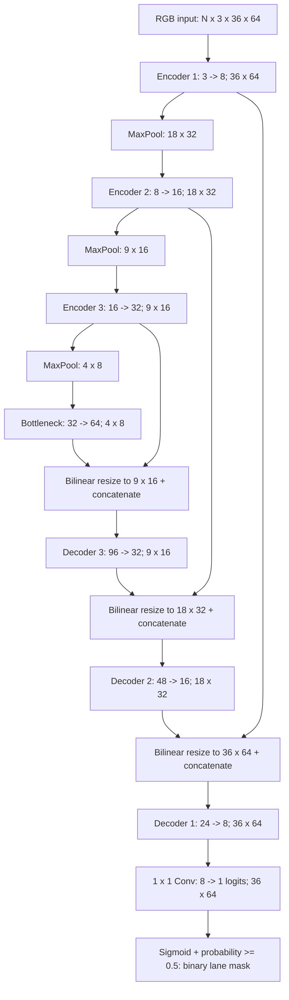

# Custom U-Net architecture

All convolution weights are Kaiming-random initialized; all layers are trained.
There is no pretrained backbone. Total trainable parameters: **122,465**.

Each encoder/decoder block has two 3x3 convolutions with padding=1,
each followed by GroupNorm (4 groups) and ReLU. The head has a bias.
GroupNorm supports small batches without running batch statistics. Three
pooling levels provide context with a small footprint. Skip connections preserve
spatial detail. Bilinear resize to the exact skip shape avoids mismatches for
36x64, 48x48 and odd dimensions, and adds no transpose-convolution parameters.
The one-channel logit head fits binary semantic segmentation and BCEWithLogits.

The model can accept larger spatial dimensions >=8, but this experiment trains
and infers at 36x64. Original 1280x720 images are resized before the network;
binary predictions are restored to source size with nearest-neighbor interpolation.
This restoration does not recover detail lost at the low input resolution.
